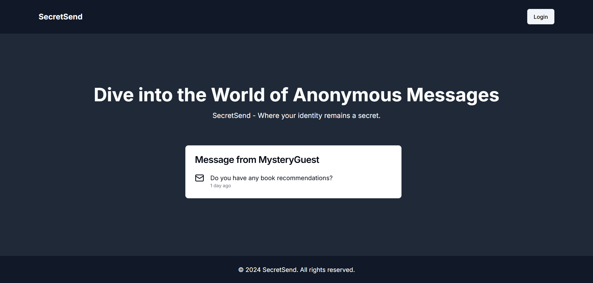
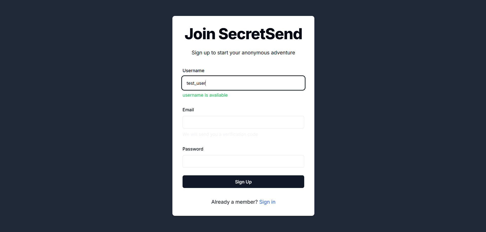
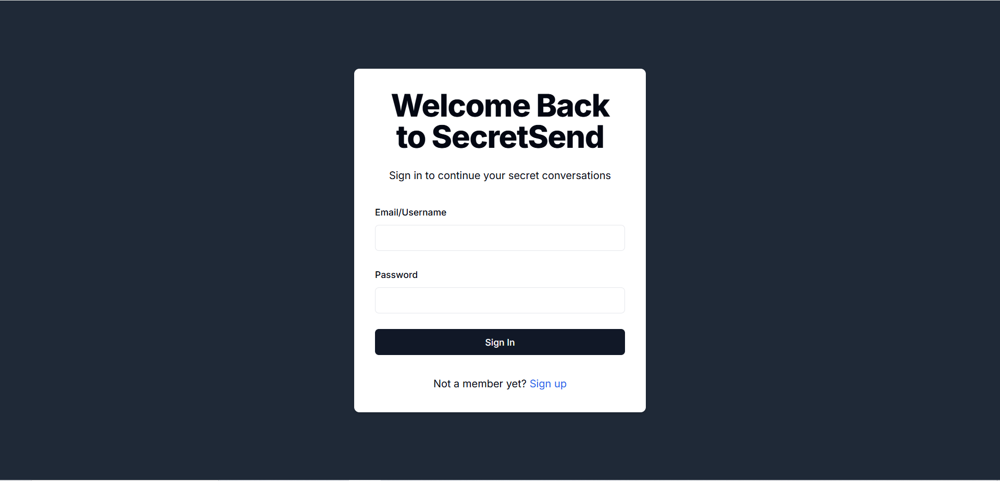
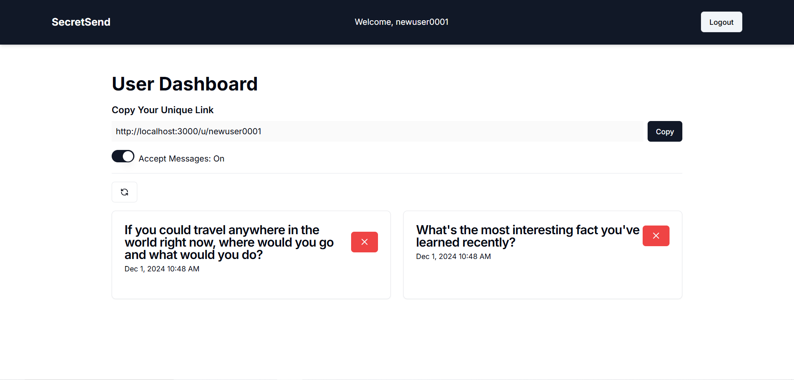
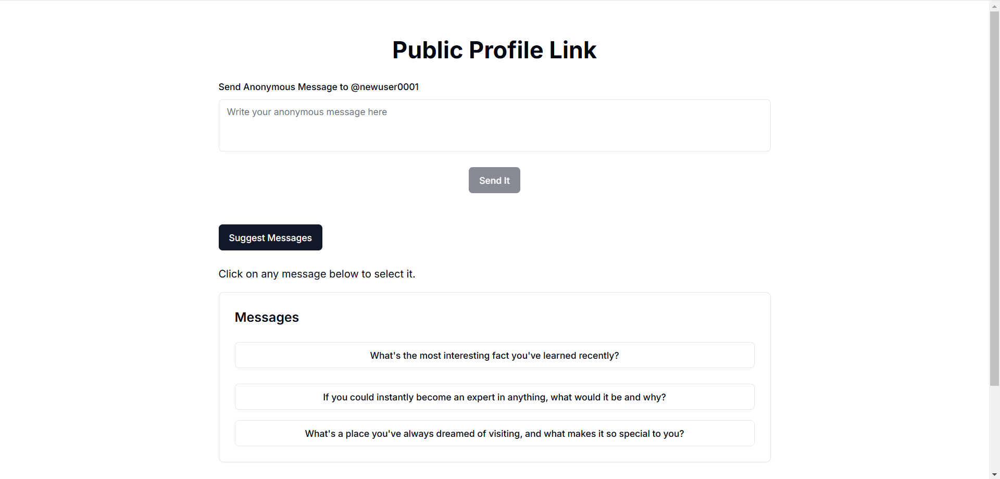

# SecretSend
This is a web application designed for secretly sending messages, featuring AI-powered suggestions for crafting messages. The project was developed as part of a Next.js course by Hitesh Choudhary, where the assignment involved integrating AI capabilities and implementing frontend routes to handle AI-generated responses.

This repository includes the complete source code for the assignment, with all functionalities successfully implemented. Additionally, skeleton components have been added to enhance the user experience during loading states and added arcjet for email verification for providing security to backend services.
## Acknowledgements

 - [Chai aur full stack NextJS](https://www.youtube.com/watch?v=OgS1ZWZItno&list=PLu71SKxNbfoBAaWGtn9GA2PTw0HO0tXzq)
 - [useCompletion()](https://sdk.vercel.ai/docs/reference/ai-sdk-ui/use-completion)
 - [Gemini Api Documentation](https://ai.google.dev/gemini-api)
 - [NextAuth.js](https://next-auth.js.org/)
 - [shadcn/ui/skeleton ](https://ui.shadcn.com/docs/components/skeleton)
 - [useDebounceValue](https://usehooks-ts.com/react-hook/use-debounce-value)

## Technologies Used

### Frontend
- **Next.js** – Framework for building React-based web applications.  
- **React-hook-form** – Simplifies form handling and validation.  
- **React-email/components** – For building and styling email templates.  

### Backend
- **NextAuth** – Authentication library for Next.js applications.  
- **MongoDB** – NoSQL database for data storage.  
- **Mongoose** – ODM library for MongoDB.  
- **BcryptJS** – For password hashing and security.  

### AI Integration
- **GeminiAI** – Provides AI-based message suggestions.  

### Utilities
- **Axios** – For making HTTP requests.  
- **Resend** – For email delivery services.  
- **Zod** – For schema validation and type safety.
- **Arcjet** – For email verification.


## Environment Variables

To run this project, you will need to add the following environment variables to your .env file

`MONGODB_URI = mongodb://localhost:27017/secretsend`

`RESEND_API_KEY`

`NEXTAUTH_SECRET`

`GEMINI_API_KEY`

`ARCJET_API_KEY`


## Run Locally

Clone the project

```bash
  git clone https://github.com/malhotraarshdeepsingh/SecretSend
```

Go to the project directory

```bash
  cd SecretSend
```

Install dependencies

```bash
  npm install
```

Start the dev

```bash
  npm run dev
```


## Lessons Learned

I learned how to use NextAuth for user authentication and how to implement email verification with it. I also explored the Zod validation library for the first time. Since this was my first experience working with AI, I gained valuable knowledge about how it is used on the backend and how to handle streaming AI responses. Implementing email verification for the very first time taught me how to use Resend and react-email/components to achieve it. Additionally, I independently implemented skeleton UI components, integrated Gemini AI, and created the frontend route for it, which gave me a lot of confidence in my skills. Aditionally added security features for backend services to protect against spam and temporary emails.

## Demo Video

[Demo video](./demo/demo.mp4)

## Screenshots


This is the homepage of the web app, which uses the ShadCN library for UI components.

The Sign-Up page dynamically validates the uniqueness of the username by making database requests through a useDebounce function.

This simple login page handles user authentication functionality.

On the dashboard page, users can view messages, toggle message acceptance, and share their profile page by copying the link to the clipboard.

On the profile page, AI-generated suggestion messages are displayed. Users can copy a message by clicking on it and send it.
